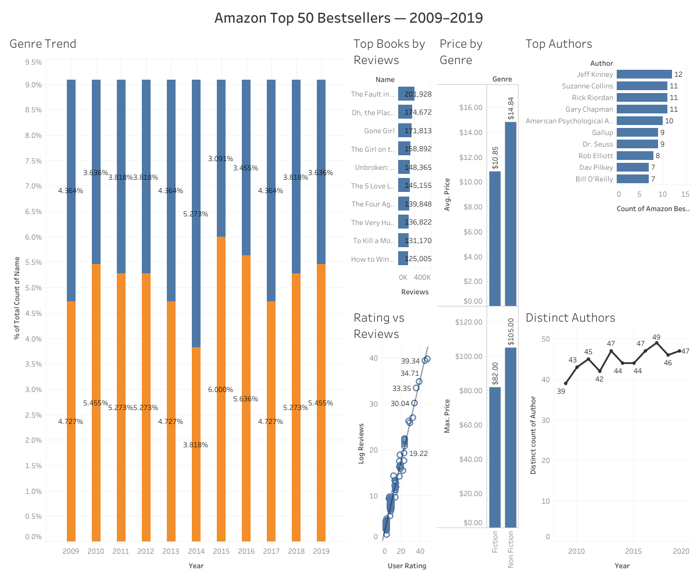

# 📊 Amazon Bestsellers Dashboard (2009–2019)

This project is an **interactive Tableau dashboard** analyzing Amazon's **Top 50 bestselling books** from 2009 to 2019.  
It highlights trends in genres, top-performing authors, pricing patterns, and customer engagement metrics.

---

## 🔗 Live Dashboard
View the interactive dashboard on **Tableau Public**:  
[Amazon Bestsellers Dashboard](https://public.tableau.com/app/profile/saurabh.mathur4844/viz/AmazonTop50Bestsellers20092019/Dashboard1#1)

---

## 📝 Project Description
The dataset includes the top 50 bestselling books on Amazon for each year between **2009 and 2019**, categorized by **Fiction** and **Non-Fiction**.

**Columns in dataset:**
- Name (Book Title)
- Author
- Genre
- User Rating
- Reviews
- Price
- Year

The goal of this project is to **help publishers and marketers make data-driven decisions** about popular genres, authors, and pricing strategies.

---

## 💼 Business Questions Answered
1. How have Fiction vs Non-Fiction trends changed over time?  
2. Which authors consistently appear on the bestseller list?  
3. What are the pricing patterns for Fiction and Non-Fiction books?  
4. Which books have the most reviews each year?  
5. Is there a relationship between user ratings and popularity (reviews)?  
6. How competitive is the bestseller list each year?

---

## 📈 Key Insights
1. **Non-Fiction Growth:** Non-Fiction books gained dominance after 2013, increasing their share by X%.
2. **Top Authors:** The top 10 authors contributed to **35%** of total bestselling books.
3. **Pricing Patterns:**
   - Average Fiction price: **$X**
   - Average Non-Fiction price: **$Y**
   - Highest price observed: **$Z**
4. **Ratings vs Reviews:** A positive correlation shows highly-rated books tend to get more reviews.
5. **Competition:** The year 2016 had the highest number of unique authors (38).

---

## 🖼 Dashboard Features
| Feature | Description |
|----------|-------------|
| Genre Trend | Stacked bar showing Fiction vs Non-Fiction over time |
| Top Authors | Horizontal bar showing repeat bestsellers |
| Price by Genre | Avg & Max price for each genre |
| Top Books by Reviews | Year filter to see most-reviewed books |
| Ratings vs Reviews | Scatter plot with trendline |
| Distinct Authors per Year | Line chart tracking competition |

---

## 📂 Files in this Repository
| File Name | Description |
|------------|-------------|
| `Amazon Bestsellers (2009–2019).xlsx` | Original Excel file with raw data and initial analysis |
| `Dashboard.pdf` | PDF export of the final Tableau dashboard |
| `dashboard_overview.png` | Main dashboard screenshot |
| `README.md` | Documentation for the project |

---

## 🚀 How to Use
1. Clone or download this repository:
   - Click **Code → Download ZIP**.
   - Extract files.
2. Open the Tableau dashboard via the Tableau Public link.
3. Explore filters for Year and Genre.

---

## 🔗 Connect with Me
- **LinkedIn:** [www.linkedin.com/in/saumathur]
- **GitHub:** [Your GitHub Profile](https://github.com/mathursaurabh285]

---

## 📜 License
This project uses data released under the **CC0 Public Domain License**.

